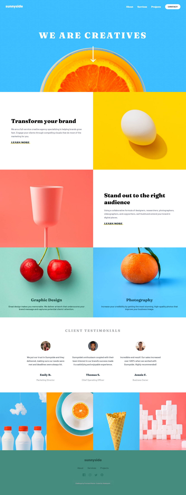

# Frontend Mentor - Product list with cart solution

This is a solution to the [Product list with cart challenge on Frontend Mentor](https://www.frontendmentor.io/challenges/product-list-with-cart-5MmqLVAp_d). Frontend Mentor challenges help you improve your coding skills by building realistic projects. 

## Table of contents

- [Overview](#overview)
  - [The challenge](#the-challenge)
  - [Screenshot](#screenshot)
  - [Links](#links)
- [My process](#my-process)
  - [Built with](#built-with)
  - [What I learned](#what-i-learned)
  - [Continued development](#continued-development)
  - [Useful resources](#useful-resources)
- [Author](#author)
- [Acknowledgments](#acknowledgments)

### Overview

### The challenge

Users should be able to:

- View the optimal layout for the site depending on their device's screen size
- See hover states for all interactive elements on the page

### Screenshot

### Links

- Solution URL: [Add solution URL here](https://github.com/DevAbdul-web/sunnyside-agency-landing--page)
- Live Site URL: [Add live site URL here](https://devabdul-web.github.io/sunnyside-agency-landing--page/)

### Built with

- Semantic HTML5 markup
- CSS custom properties (variables)
- Flexbox & CSS Grid
- Mobile-first responsive workflow
- CSS animations and transitions
- Vanilla JavaScript (for navigation toggle)

### What I learned

During this project, I reinforced my knowledge in:

- Building a responsive landing page from scratch
- Using CSS variables for consistent theming
- Flexbox and Grid for layout across sections
- Implementing a hamburger navigation toggle for mobile devices
- Creating smooth hover effects and animated elements

### Continued development

In future projects, I want to:

- Add scroll animations for a more dynamic experience
- Optimize images for better performance
- Enhance accessibility (ARIA labels, keyboard navigation)
- Explore CSS Grid layouts for complex galleries

### Useful resources

[CSS-Tricks Flexbox Guide](https://css-tricks.com/snippets/css/a-guide-to-flexbox/)
- Helped me structure responsive sections using Flexbox

[MDN – CSS Variables](https://developer.mozilla.org/en-US/docs/Web/CSS/Using_CSS_custom_properties)
- Clarified usage of CSS custom properties

[Frontend Mentor](https://www.frontendmentor.io/)
- Design inspiration and challenge source

### Author

Frontend Mentor: [@DevAbdul-web](https://www.frontendmentor.io/profile/DevAbdul-web)

GitHub: https://github.com/DevAbdul-web

###  Acknowledgments

Thanks to Frontend Mentor for providing this challenge and design assets

Inspiration from modern agency landing pages and design patterns
